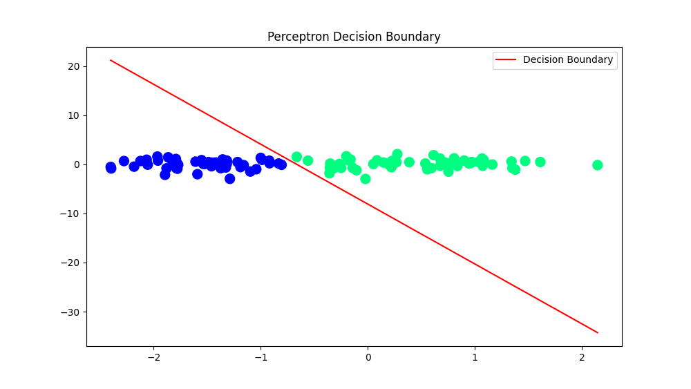

# NN1-Perceptron

This repository contains the implementation of a Perceptron (Single Neuron) from scratch in Python.

## Introduction

This project implements the **Perceptron Algorithm**, a fundamental binary classification model in machine learning. The perceptron is trained to classify linearly separable data into two distinct classes using iterative weight updates. The implementation includes customizable convergence criteria and supports visualization of the decision boundary.

## Features

1. Custom implementation of the perceptron algorithm in Python.  
2. Supports binary classification for linearly separable data.  
3. Convergence is determined by a user-defined threshold based on normalized residual errors.  
4. Visualizes the dataset and decision boundary.  

## Installation

Install the required dependencies using the following command:
       
        pip install numpy matplotlib scikit-learn

## Code Structure

### 1. Dataset Generation
The dataset is generated using `sklearn.datasets.make_classification` with two features, ensuring linear separability.

### 2. Perceptron Algorithm
The perceptron algorithm is implemented based on the explanation and updates outlined on Wikipedia's Perceptron page.

  Includes:
- **Step Function**: Produces binary outputs for classification.
- **Weight Initialization**: Initializes weights randomly for all features.
- **Error Calculation**: Computes the difference between predicted and actual labels.
- **Weight Update Rule**: Iteratively updates weights
- **Convergence Criteria**: Stops training when the normalized Residual Sum of Errors (RSE) falls below a user-defined threshold.

### 3. Visualization
Utilizes `matplotlib` to plot:
- Data points, color-coded by class labels.
- The decision boundary learned by the perceptron.

# Example 

